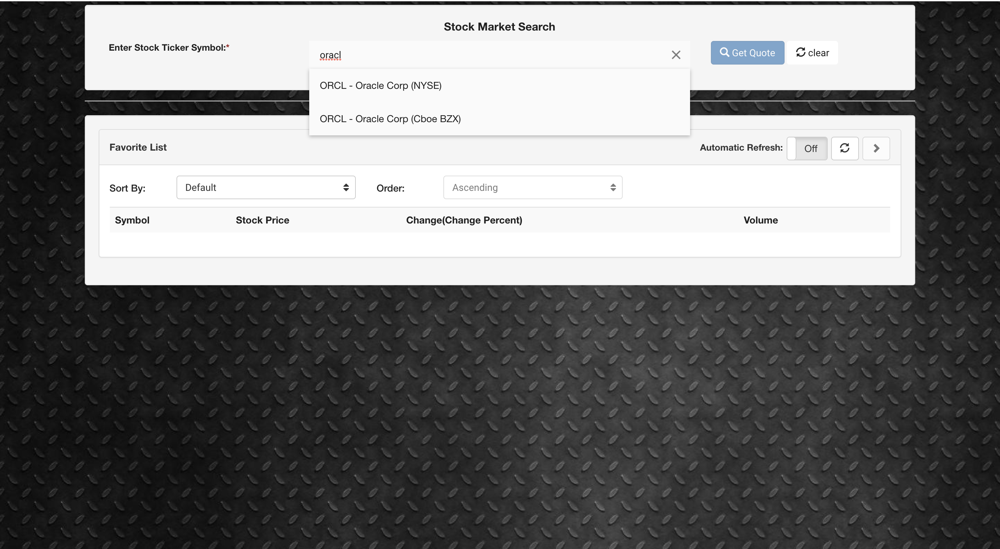
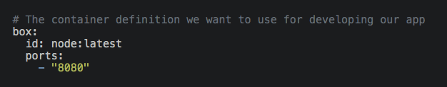
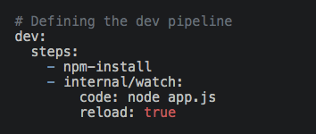
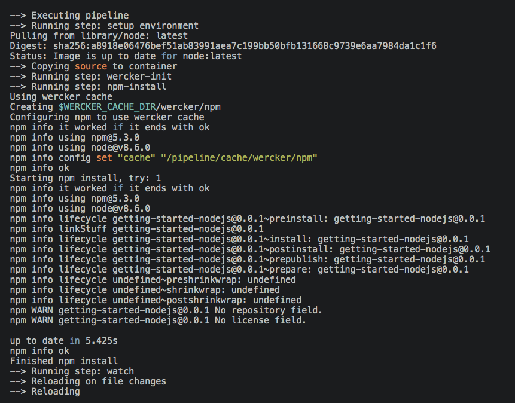
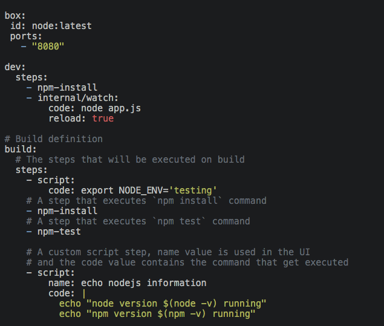
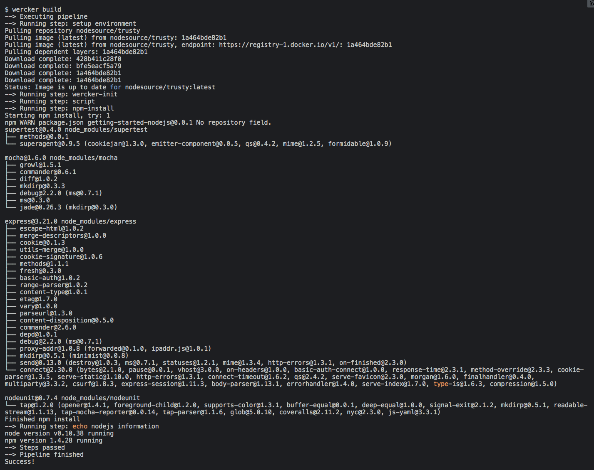
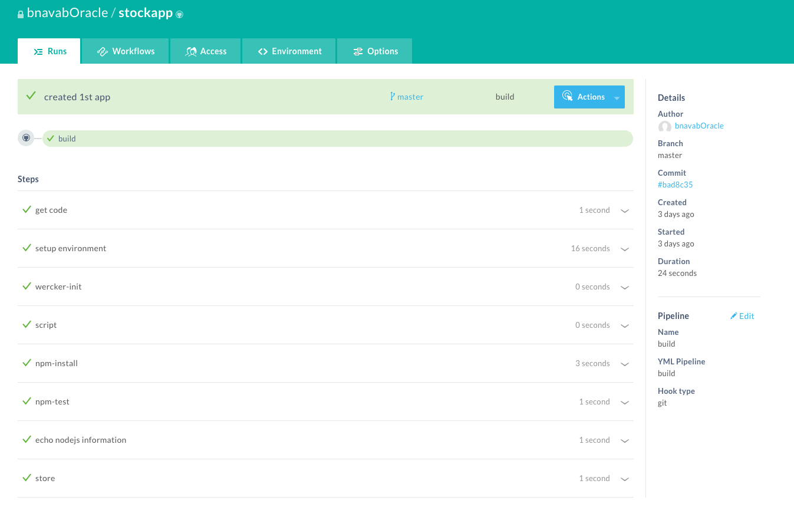

  
Updated: June 20, 2019

## Introduction

This is the first of several labs that are part of the **`Oracle Public Cloud DevOps Cloud Native Microservices workshop.`** This workshop will walk you through A continuous integration and deployment (CI/CD) pipeline.

This guide is a step-by-step approach to developing, building and deploying a sample app with **Wercker** within minutes. 

While this guide uses Javascript, the general concepts explained in this tutorial apply to every other programming language.

**_To log issues_**, click here to go to the [github oracle](https://github.com/OracleBasir/CICD-Pipeline-StockNews-App/issues) repository issue submission form.

# Requirements
- A Wercker account
- The Wercker CLI
- Basic knowledge of Git
- Git install on your machine

# Setting up the app
Before we can start developing, we have to fork and clone the sample app into our local development environment

### **STEP 1**: Clone the Sample Stock News Application from github
- From any Terminal, go to your desktop directory
- Clone the sample application from the git repository

    `git clone https://github.com/OracleBasir/stockapp.git`

- Next, assuming you have Node installed locally, you can simply launch the sample app::

    `$ node server.js`

- After you’ve done that, cd into the project directory:

    `$ cd stockapp/`
- Now in your browser navigate to localhost:8089 and you should see the stock news application

    

### **STEP 2**: Developing the app

Now that we’ve setup our app we can start changing some part of our app. 

After we did our changes, let’s first take a look at the wercker.yml file included in your project folder. 

- wercker.yml

        # The container definition we want to use for developing our app
        box:
        id: node:latest
        ports:
            - "8080"

    

    - The initial box section defines two things. The id property states which container image you want to use for your project; as we’re developing with NodeJS in this sample we’re using the node:latest image. These container images are retrieved from Docker Hub if no other registry is specified. You can read more about containers here. The ports property specifies the ports that you want your running container to open. This example only requires a single port but you can specify multiple ports here.

    - Now let’s look at the dev section:

        # Defining the dev pipeline
        dev:
        steps:
            - npm-install
            - internal/watch:
                code: node app.js
                reload: true

        

    - In the dev pipeline clause we define what we want to happen in our development pipeline, which in this case consists of two steps: npm-install and internal/watch. The first of these, npm-install, is a wercker step that, unsurprisingly, runs npm-install. The internal/watch step watches your files for changes, and if reload is set to true it restarts your app so your changes are reflected immediately. This is especially useful for when you’re developing webapps, as we’re doing now. Both of these steps are pre-written bash scripts written by either wercker or the community. You can read more about steps here.

    - Let’s see these steps in action now and fire up our dev pipeline.

- Wercker dev
    -  In your project folder, run **wercker dev –expose-ports**. You should see something similar to the following output:

    

    - Wercker first checks out your code and then sets up the container environment. This means that the container will be pulled from Docker Hub and subsequently started with access to your checked out code. It will then start executing all the steps that are defined in the wercker.yml.

    - If you navigate once again to localhost:8089 you should see your changes.

    - Once you save your changes, the app should automatically reload. If you refresh your page, our new city should be there! Hurrah!

    - There are many more steps to use for developing your app. Take a look around, and if you can’t find the step you’re looking for, you can always make your own.

    - Now that we’re done developing, we want to push our changes and let wercker build and deploy our app for us.

### **STEP 3**: Building your app

First, let’s revisit our wercker.yml again.

    box:
    id: node:latest
    ports:
    - "8080"

    dev:
    steps:
        - npm-install
        - internal/watch:
            code: node app.js
            reload: true

    # Build definition
    build:
    # The steps that will be executed on build
    steps:
        - script:
            code: export NODE_ENV='testing'
        # A step that executes `npm install` command
        - npm-install
        # A step that executes `npm test` command
        - npm-test

        # A custom script step, name value is used in the UI
        # and the code value contains the command that get executed
        - script:
            name: echo nodejs information
            code: |
            echo "node version $(node -v) running"
            echo "npm version $(npm -v) running"

### **STEP 4**: Build Pipeline

We’re now interested in what’s happening the build pipeline, where we’ve added a new kind of step: a script step. This script step is a piece of inline bash code which we’re using to run our tests. You can create and share these kind of steps with the community by submitting a step to our repository.

### **STEP 5**: Wercker build

Now that we have a better understanding of our wercker.yml let’s go ahead and let wercker build our project. In your project folder, first **' run rm -r node_modules '**, and then **' wercker build '**:

Building locally is very useful when you’re not sure your code will run because of some changes you made. As such you don’t want to push these changes to your Git provider just yet.

But since we’ve verified that our app is compiling and running correctly, it’s time to let wercker build & deploy your app in the cloud, which is what we’ll be doing in the next section.

### **STEP 6**: Adding your app to Wercker

The next step is to create a new application on wercker. Head over to **`https://app.wercker.com/`** and select Add application from the top menu bar.

- Select the Owner and Git Provider
    - First we have to choose who owns the app. For this tutorial, go ahead and select yourself. If you prefer, you can select an organization you created on wercker.

    - Now select GitHub as your Git provider (BitBucket and GitLab are also available), and then click Next.

- Select the repository
    - You now see a list of your existing repositories. Select theNodeJS example you forked earlier from the list and click Next.

 - Configure Access
    - The next step is about configuring access, and the first option wercker will check out the code without using an SSH key is fine for the purpose of this tutorial, because it’s an open source and public application. So go ahead and click Next.

- Review application details
    - Finally, once you’ve verified all the settings, click Create to complete setting up our app. Now you can trigger the first build!

- Triggering your first build
    - The Nicely Done! screen gives you the option to generate a wercker.yml file. But as the repository already contains one, all you have to do is click trigger a build now .

    - The Runs page now shows a new build has been triggered! This build will do the exact same as the one you triggered locally but now everyone in your team can see and comment on the build.

-----------------

**`Wrapping up`**

Congratulations! You’ve built your first app using Wercker.

