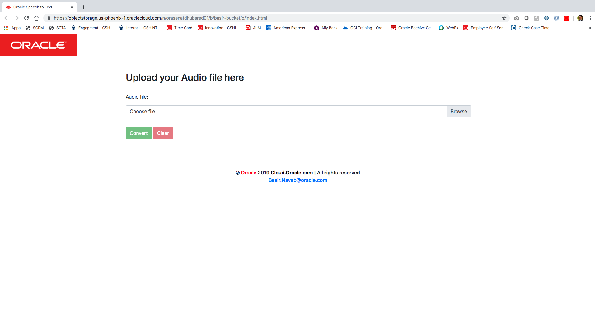

  
Updated: June 20, 2019

## Introduction

This is the first of several labs that are part of the **`Oracle Function, serverless`** This workshop will walk you through how setup, create, and deploy a serverless application to Oracle function.

While this guide uses Javascript, the general concepts explained in this tutorial apply to every other programming language.

**_To log issues_**, click here to go to the [github oracle](https://github.com/OracleBasir/AudioToText_ServerLess/issues) repository issue submission form.

# Requirements
- Oracle Cloud Account
- Basic knowledge of Git, JavaScript, Rest APIs, 
- Basic knowledge of ServerLess fundamental 
- Install Git on your machine
- Install Node.js and npm on your machine
- docker installed on your machine

# Setting up the app
Before we can start developing, we have to Set up your tenancy then 
Set up your client, finally, Create, deploy, and invoke your function. 

### **STEP 1**: Set up your Oracle Serverless Function 
- go to this URL and follow the offical steps to set up your tanancy and at the end your oracle function. 

    https://www.oracle.com/webfolder/technetwork/tutorials/infographics/oci_faas_gettingstarted_quickview/functions_quickview_top/functions_quickview/index.html

### **STEP 2**: Deploying the back end to the Oracle Function.

Now that we’ve setup our Oracle function we can start deploying our application to Oracle Function. 

download fn function from audio_to_txt folder in the [github](https://github.com/OracleBasir/AudioToText_ServerLess/) and replace to your fn function locally.

"func.js" your function code which handle the request from the Front End. 

deploy the new function to Oracle Function

    # fn deploy --app <yourApp-Name>

Now you can test your function by some sample data

    # echo -n '{"selectedAudio": "data:audio/mp3;base64,UklGRmQAAABXQVZFZm10IBAAAAABAAEAgD4AAAB9AAACABAAZGF0YUAAAAAAAAAAAAAAAAAAAAAAAAAAAAAAAAAAAAAAAAAAAAAAAAAAAAAAAAAAAAAAAAAAAAAAAAAAAAAAAAAAAAAAAAAA", "selectedAudioName": "zero.mp3"}' | fn invoke SM_AppDev_AudioToText audio_to_txt
    
You should receive

    {"firstResponce":{"balance":324,"check_wait":null,"cost":0,"id":13786514},"secondResponse":{"job":{"lang":"en","user_id":68879,"name":"zero.mp3","duration":0,"created_at":"Mon Jul 15 18:45:41 2019","id":13786514},"speakers":[],"words":[],"format":"1.0"}}

Now our function is up and working.
it's the time to deploy the front end to the object storage.

### **STEP 3**: Deploying the front end to object storage

First, you need to download the fron end from the front end folder at [github](https://github.com/OracleBasir/AudioToText_ServerLess/)

Now you have your front end, we need to deploy it to the object storage. 

- login to your tenancy
- click on the hamberbar in the top lef of your broswer 
- choose Object Storage -> Object Storage
- press on Create a bucket button 
- choose a **BUCKET NAME** for your bucket
- After creating, click on the your bucket.
- click on **Edit Visibility** 
- Make it **public** Visibile

now you are ready to upload your objs to your bucket
- Click on **Upload Object** button 
- Drop each files in the frontEnd folder which you downloaded from github to your bucket. 

now you upload your files. you want load your front end. 
- click on the 3 dots on the right side of the **index.html**
- choose **View Object Details**
- Under **Object Details** you can see URL Path (URI)
- This is the path to your fron end. 
- click on the path and a new tab will show up with the fron end

-----------------

**`Wrapping up`**

Congratulations! You’ve built your first server less app using Oracle Function.

